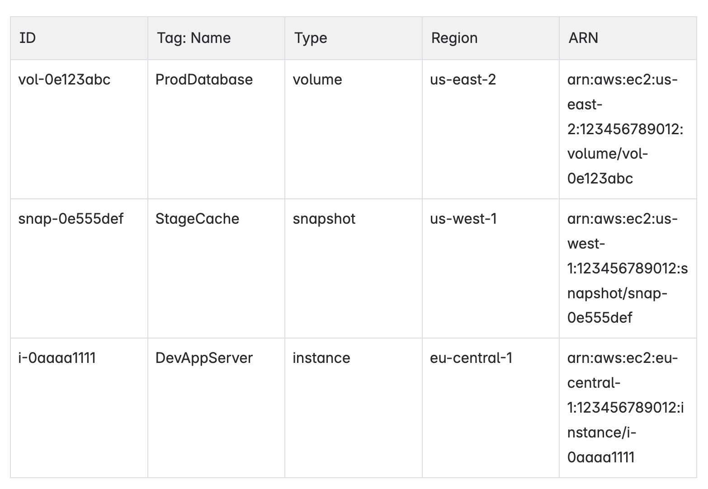

# aws-csv-to-confluence

Upload an AWS resource inventory (exported as CSV from **Tag Editor**) to Confluence, one page per **Service**.
Written in Python, packaged with [**Poetry**](https://python-poetry.org/docs/#installation), and shipped with an optional Docker image.

---

## Table of contents

1. [Features](#features)
2. [CSV format expectations](#csv-format-expectations)
3. [How to export AWS resources to CSV](#how-to-export-aws-resources-to-csv)
4. [How to create an Atlassian API token](#how-to-create-an-atlassian-api-token)
3. [Quick start](#quick-start)
4. [Command-line reference](#command-line-reference)
5. [Examples](#examples)
6. [Docker](#docker)
7. [Development & tests](#development--tests)
8. [License](#license)

---

## Features

- **One Confluence page per AWS service**
  Creates a separate page for each service (EC2, S3, Lambda, etc.)
- **Ignore filters**
  - `--ignore-group` - skip specific resource groups
  - `--ignore-resource-type` - skip specific resource types
- **Cleanup option**
  - Use `--clean` to remove pages from previous runs that are no longer needed
- **Simple output**
  - Generates basic Confluence **storage tables** (no macros or formatting tricks)
- **Minimal dependencies**
  - Uses only two exteranl libraries:
    [Atlassian Python API wrapper](https://github.com/atlassian-api/atlassian-python-api) and `docopt`

---

## CSV format expectations

The script needs **six columns** to be presented in a file:

| Column            | Notes                                  |
|-------------------|----------------------------------------|
| `Identifier`      | e.g. `vol-0abc…` / `i-0123…`           |
| `Tag: Name`       | Empty values become "`(not tagged)`"   |
| `Type`            | `instance`, `snapshot`, `bucket`, ...  |
| `Region`          | `us-east-1` / `eu-central-1` ...       |
| `ARN`             | Full resource ARN                      |
| `Service`         | Logical grouping key (`ec2`, `s3`)     |

All other columns are being ignored.

---

## How to export AWS resources to CSV

This tool uses CSV files generated by the [AWS Tag Editor](https://docs.aws.amazon.com/tag-editor/latest/userguide/gettingstarted.html).
Follow the steps below to export all tagged resources as a CSV:

1. Sign in to your AWS account
2. Navigate to **Resource Groups & Tag Editor**
3. In the Tag Editor:
   - Select **All regions**
   - Choose **All supported resource types**
   - Click **Search resources**
4. Once the resources list is compiled, download the CSV file

## How to create an Atlassian API token

To authenticate with the Atlassian API, the application needs an API token. Follow these steps to generate one:

1. Sign in to your Atlassian account at [https://id.atlassian.com](https://id.atlassian.com)
2. Navigate to [**Security / API tokens**](https://id.atlassian.com/manage-profile/security/api-tokens)
3. Click **Create API token**
4. Enter a name for the new token and click **Create**
5. Copy and save the token - it will only be shown once

## Quick start

```bash
# 1. Clone & install
git clone https://github.com/dunterov/aws-csv-to-confluence.git
cd aws-csv-to-confluence
poetry install

# 2. Run
poetry run aws-csv-to-confluence \
    --user alice@example.com \
    --token <ATLASSIAN_TOKEN> \
    --url https://mycorp.atlassian.net/wiki \
    --parent 123456789 \
    --file ./resources.csv \
    --subtitle prod \
    --clean
```

**Result:**  
* `[AWS] [prod] ec2`, `[AWS] [prod] s3`, ... pages created (or updated) under page with id `123456789` in a Confluence. Page content structure will be similar to the one shown below:



* Old child pages last edited _before_ the run and _not_ recreated are deleted.

---

## Command-line reference

```text
aws-csv-to-confluence --user USER --token TOKEN --url URL --parent PARENT --file FILE
                        [--subtitle SUBTITLE]
                        [--ignore-group GROUPS]
                        [--ignore-resource-type TYPES]
                        [--clean]
                        [--dry-run]

Options:
  --user USER                  Confluence user (required)
  --token TOKEN                Atlassian token / password (required)
  --url URL                    Base URL, e.g. https://mycorp.atlassian.net/wiki (required)
  --parent PARENT              Confluence parent page ID (required)
  --file FILE                  Path to the CSV file to process (required)
  --subtitle SUBTITLE          Text inserted in square brackets after "[AWS]" in the page title
  --ignore-group GROUPS        Comma-separated resource groups to skip (e.g. ec2,s3)
  --ignore-resource-type TYPES Comma-separated resource types to skip (e.g. snapshot,instance)
  --clean                      Delete stale child pages after publishing
  --dry-run                    Do everything except call the Confluence REST API
```

---

## Examples

### Ignore whole resource group *and* specific resource types

```bash
--ignore-group iam --ignore-resource-type snapshot,volume
```

### Dry-run mode (no changes made)

Use the `--dry-run` flag to preview what the tool *would* do without actually creating or deleting any pages in Confluence.
This is useful for testing or verifying changes safely.

---

## Docker

A minimal image is provided:

```bash
# build
docker build -t aws-csv-to-confluence .

# run
docker run --rm -v `pwd`/resources.csv:/resources.csv aws-csv-to-confluence \
    --user alice@example.com \
    --token <ATLASSIAN_TOKEN> \
    --url https://mycorp.atlassian.net/wiki \
    --parent 123456789 \
    --file /resources.csv \
    --clean
```

---

## Development & tests

```bash
# set up
poetry install

# run unit tests
poetry run pytest

```

The **test suite** uses small in-memory CSV snippets and a `DummyConfluence`
stub, so it never touches a real wiki.

---

## License
MIT - see [`LICENSE`](LICENSE) for full text.
